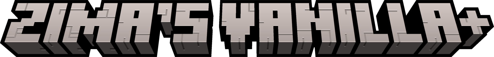
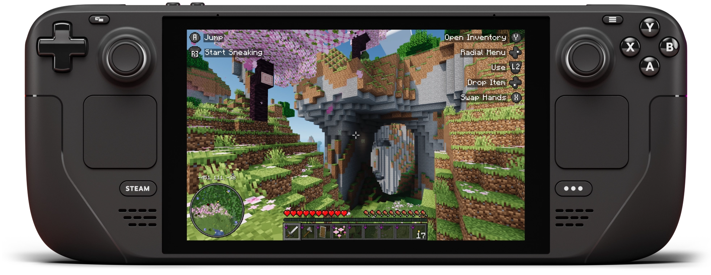

**STEAM DECK USERS:** Refer to the
[Steam Deck Setup](#steam-deck-setup) section
for setup instructions and performance adjustments.

Zima's Vanilla+ is a compact modpack designed to enhance performance and bring
minor QoL improvements to the vanilla Minecraft experience. Unlike other vanilla
modpacks, Zima's Vanilla+ uses as few mods as possible to minimize impact on
performance.

Zima's Vanilla+ comes in two editions: NeoForge and Fabric. The editions are
identical, with the exception of Euphonium replacing AmbientSounds in the Fabric
variant.

---

## QoL Overview

This modpack introduces a change to tree farming with the FallingTree mod. When
players chop down a tree with an axe, the entire trunk will break instantly into
logs. The number of logs broken will still affect the axe's durability. If the
player's axe breaks while chopping a tree, the entire tree will still fall.
FallingTree will not interfere with vanilla servers, and you can leave it
enabled when joining them.

Along with FallingTree, this modpack brings additional QoL improvements,
including:

- Native controller support, including Steam Deck.
- A minimap and world map.
- Sound mods, including post-processing, UI sounds, and ambient sounds.
- A better first-person experience.
- Improvements to the inventory UI and UX.

## Preconfigured Settings

By default, the game comes with the Pixel Perfect shaderpack enabled, and a
capped framerate of 30 FPS. This is to prevent overheating on laptop devices or
low-end machines. Desktop players may want to adjust their framerate cap on
first launch. Players with low-performance machines may want to consider
switching to the VanillAA shaderpack or disabling shaders altogether.

## Steam Deck Setup

Unfortunately, there's no way for this modpack to set everything up for you
automatically. But you only have to do this once, and it will get you the best
experience when playing on your Steam Deck.

First, [install Prism Launcher](https://prismlauncher.org/download/steam-deck/)
from the Discover app in Desktop Mode. Then, read the sections below to learn
how to configure your hardware, download the pack, setup your controller config,
and adjust video settings.

**DO NOT FORGET TO ADD PRISM LAUNCHER TO YOUR STEAM LIBRARY.** This is required
for controller support to work.

### Configuring the Controller

Before launching Prism, you'll want to configure controller input.

1. In Game Mode, navigate to Prism Launcher. Open the page for it, but don't
   launch it yet.
2. Find and select the controller icon. This should open the controller
   configuration page.
3. If the current button layout is not already set to "Gamepad With Joystick
   Trackpad", change the button layout to this template.
4. Once the template is selected, navigate to **Edit Layout** -> **Trackpads**.
5. From here, change the right trackpad's behavior to "As Mouse" and set its
   click behavior to "Left Mouse Click". Leave the touch behavior unconfigured.
6. If you'd like, you may want to create a virtual menu attached to the left
   trackpad to bind keyboard buttons, like `M` for opening Xaero's World Map.

### Installing the Modpack

> If you're a pro: install the modpack from Modrinth in Prism and skip this
> section.

If possible, you may want to use a keyboard and mouse through this section. If
that is not an option, you can open the keyboard by holding the `[STEAM]` button
and pressing `X`.

1. Switch to Game Mode and open Prism Launcher.
2. When prompted, select Java version 21 and configure your maximum memory
   allocation to 8192 MiB. Do **not** exceed this maximum, especially if your
   VRAM is set to 4 GiB.
3. The rest of the wizard should be self explanatory.
4. Once you've finished the wizard, you'll want to sign in to your Minecraft
   account. Click the icon at the top-right corner of the screen, then select
   **Manage Accounts...** and sign in to your account.
5. Once you're signed in, return to the main screen. You may have to close the
   settings window.
6. Click the **Add Instance** button at the top-left corner of the screen. Then,
   select "Modrinth" from the list and search for "Zima". The list of modpacks
   will filter down; select "Zima's Vanilla+" from the list.
7. Before clicking **OK**, make sure you've selected the version you wish to
   install. You can choose between the NeoForge and Fabric versions. You may
   also with to install an older version if you wish. Once you've selected a
   version, click **OK**.

### Controller Configuration

Start with the template called "Gamepad with Joystick Trackpad" and make the
following changes at minimum:

1. Change the right trackpad's behavior to function as a mouse
2. Set the right trackpad's click to perform a mouse left click

Optionally, you can create a virtual menu for the left trackpad. My virtual menu
is configured with the following entries:

- Open the map with the `M` key
- Create a waypoint with the `B` key
- Reload shaders with the `R` key (useful for debugging)

#### In-game Configuration

Once you've configured your controls, launch the game. Controlify will prompt
you to download a support library. **You absolutely want to do this.**

After downloading the library, head over to **Options** -> **Controls** ->
**Controller Settings** and select the **Settings** button for the Steam Deck.
From there, go to the **Advanced** tab and enable "Mixed Input". This will allow
you to use the mouse while playing and prevent the Steam Deck's input from being
disabled when using the mouse.

### Recommended Performance Configurations

Zima's Vanilla+ has a balanced preset configured out of the box, and you do not
have to adjust any Steam Deck Performance settings to benefit from them.
However, you may find the following changes beneficial depending on how you
game:

| Setting | Value | Description |
|-|-|-|
| Use per-game profile | On | This goes without saying, but you'll want to turn this on as to not change your performance settings globally. |
| Disable Frame Limit | On | Turn this off to decrease latency, as we're using the game's built-in frame limiter. |
| Allow Tearing | On | For the same reasons as above. |
| TDP Limit | 8-9 Watts | Not required, but I build and test this pack at 8 watts. Setting this to 8-9 watts will reduce heat and conserve some additional battery power. Highly recommended if you choose to play without a framerate cap + VSync disabled. |

In addition to the above, here are a few configuration options that work well
for me. Leave the built-in VSync option enabled to keep frames smooth.

**Do not turn off VSync without capping your framerate.** I am not responsible
if you melt your Steam Deck.

| FPS Target | Shader | In-game FPS Limiter | Refresh Rate Configuration |
|-|-|-|-|
| 30 FPS (Default) | Pixel Perfect with Vanilla ++ preset | 30 FPS | 60/90 Hz |
| 60 FPS | Pixel Perfect with Vanilla + preset | Unlimited | 60 Hz |
| 90 FPS | VanillAA or none | Unlimited | 90 Hz |
